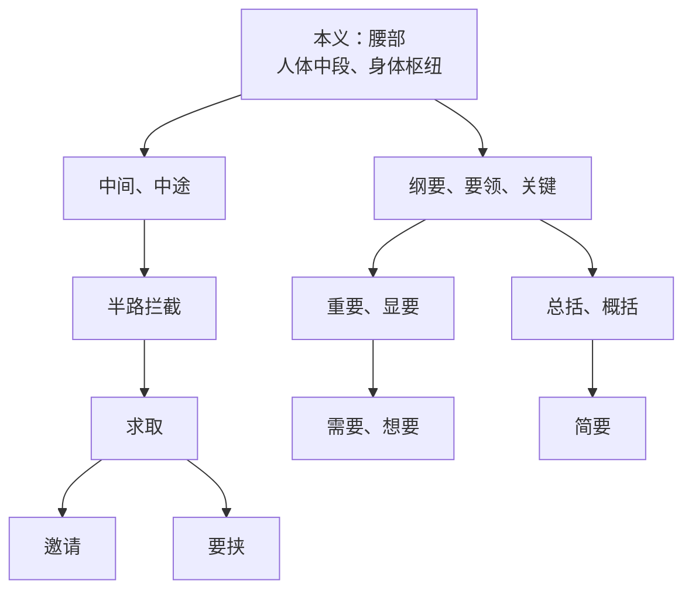

从《桃花源记》“要”字注释改动，读懂文言文里的古今字与通假字
  ![[文言文学习卡通图.png]]

统编版初中语文八年级下册新版教材中，《桃花源记》“便要还家”一句的注释，从旧版的“要（yāo），同‘邀’，邀请”，改为了“要（yāo），邀请”。

![[桃花源记_2024年版课本.jpg]]

![[桃花源记_2026年版课本.jpg]]

这处看似微小的改动，引发了不少师生的困惑，甚至有观点认为这是“教材注释的败笔”，“明明字典都标了‘古同邀’，删掉标注反而不方便学生理解”。

但事实上，这处改动绝非轻率的调整，而是有着严谨的学术依据，更贴合初中文言文的教学逻辑。我们现在就来理清这处改动的底层逻辑，同时探讨一下中学阶段最容易混淆的文言概念：古今字、通假字与假借字。

## 一、先搞懂：“邀请”从来不是“要”的“外来义”
 
很多人以为，“要”是一个通假字，表“邀请”是借用了“邀”的意思。这恰恰是对汉字演变的误解。我们先还原“要”字完整的词义发展脉络。

 
梳理词的本义和引申义，得从字形下手。“要”是会意字，甲骨文的字形是“双手叉腰的女子”，本义就是人的腰部。

东汉许慎《说文解字》明确注：「要，身中也」，先秦文献中均用“要”表腰部，比如《墨子·兼爱》“昔楚灵王好士细要”，“细要”就是我们今天说的“细腰”。

从“腰部（身体中段）”的本义，“要”自然引申出“在半路拦截、截住”的含义。比如，《后汉书·班超传》：“乃遣兵数百于东界上要之。”而“半路截住人”，既可以是强行拦截，也可以是主动留住、约请对方，由此再引申出“约请、邀请”的意思。

早在先秦时期，“要”表“邀请”就已是通用规范用法，比如《诗经·桑中》“要我乎上宫”，《史记·鸿门宴》“张良出，要项伯”。陶渊明写《桃花源记》的东晋时期，“邀”字虽已出现，但并未成为通用规范字，《说文解字》中甚至都未收录该字。

也就是说，陶渊明用“要”表“邀请”，是当时完全正统、规范的写法，根本不是“写别字、借音字”。

![[要_本义引申义.png]]

## 二、别搞混：分清古今字与通假字
 
很多人对这处改动的困惑，根源在于长期以来对“古今字、通假字、假借字”三个概念的混淆，是时候把这件事说清楚了。
 
（一）通假字：本有其字，临时借音
 
王力先生明确指出，通假字的本质是**共时的临时借用**。同一个时代，作者本该用规范的“本字”，却临时借用了一个读音相同/相近、本义和句中含义完全无关的“借字”，核心是“借音不借义”。
 
举个例子，《史记·项羽本纪》“旦日不可不蚤自来谢项王”中的「蚤」通「早」。“蚤”的本义是跳蚤，和“早晨”没有任何词义关联，只是古音相近，被临时借来替代“早”，是典型的通假字。

《古汉语常用字字典》《新华字典》中，通假字统一用「通」标注，和其他用法严格区分。
 
（二）古今字：词义分化，后造新字
 
古今字的本质是**历时的造字分化**。先出现的“古字”一身承担了多个义项，极易产生歧义，后世为了区分，专门给其中一个引申义项造了“今字”，专门分担该含义。二者有直接、完整的词义引申链条，绝非临时借用。
 
 举个例子：《〈论语〉十二章》“不亦说乎”中的「说」与「悦」。“说”的本义是“说话、解说”，引申出“高兴、愉快”的含义，后来为了避免歧义，加形旁“忄”造了今字“悦”，专门承担“愉快”的义项。
 
 我们讨论的「要」与「邀」，正是典型的古今字。“邀”是为了分担“要”的“拦截、邀请”义项，专门加形旁“辶”造的后起今字。
 
 《古汉语常用字字典》中，“这个意义后来写作X“就是表示古今字。

![[古汉语常用字字典_要.jpg]]

（三）假借字：本无其字，依声托事
 
假借字的核心是**本无其字的同音借用**：早期汉语中，某个词没有专门的书写用字，就借用一个读音相同、本义无关的字来记录它，和通假字“本有其字”的前提完全不同。
 
举个例子：《富贵不能淫》“往之女家”中的「女」与「汝」。上古早期，第二人称代词“你（rǔ）”没有专门的本字，就借用读音相同、本义为“女子”的「女」来记录；后来为了避免歧义，又借用了本义为汝水（水名）的「汝」，专门承担第二人称代词的用法。二者的本义都和“你”没有任何关联，纯粹是借音表义。
 
我们用一张表，就能一眼看清三者的核心边界：

| 概念  | 含义        | 词义关联              | 典型例子              |
| --- | --------- | ----------------- | ----------------- |
| 通假字 | 本有其字，临时借用 | 借字与本字本义完全无关       | 蚤通早，畔通叛           |
| 古今字 | 古字多义，后造今字 | 今字义项来自古字的引申，有直接关联 | 要 - 邀、说 - 悦、反 - 返 |
| 假借字 | 本无其字，依声托事 | 借字本义与句中义完全无关      | 女 - 汝             |

## 三、这些常见说法，到底错在哪？
 
围绕这处注释改动的诸多争议，本质都是对上述概念的混淆，最近在网上看到各种言论，我想我们需要逐一澄清几个误区。
 
误区1：“删掉‘同邀’是注释败笔，标了才方便学生理解”。
 
恰恰相反，这处改动是学术上的严谨纠偏，更贴合初中教学逻辑。

旧版标注「同‘邀’」，是教学上的简化处理，但极易误导学生：绝大多数学生会误以为“要”在这里是通假字，是古人写了别字，借用了“邀”的意思，完全误解了文言用字的本来面貌。当前，教师在讲解通假字时，为了方便学生理解，会说“通假字“就是错别字，又由于中学不讲古今字，往往都按通假字处理，过多的”同“，会让学生认为古人写字太不严谨，对先贤产生误解。

新版直接注「要（yāo），邀请」，既明确了读音，又讲清了语境义，完整覆盖了学生读懂文本的所有需求，同时还能让学生明白：“要”表邀请是古代的规范用法，不是写别字，更能帮助学生理解汉字的词义引申规律。
 
误区2：“‘要-邀’和‘女-汝’完全一样，都该标‘同’”。
 
这是最核心的逻辑错误，二者的文字学本质天差地别，根本不能等同。
「女-汝」是假借关系：“女”的本义“女子”和句中义“你”没有任何关联，学生根本无法从“女子”的本义推导出“你”的含义，必须用通行正字「汝」做对应注释，否则学生无法理解。
而「要-邀」是古今字关系：“邀请”是“要”本身固有的引申义，直接注释词义，学生就能完全理解，无需画蛇添足加「同‘邀’」。
 
误区3：“《新华字典》中”要“标了‘古同邀’，教材也该如此”
 
这是对字典和教材的功能定位的误解。

《新华字典》《古汉语常用字字典》的核心功能，是收录汉字的所有历时用法，标注「古同」是为了给读者做古今用法的对照，服务于读者查考所有历史用法的需求。

而语文教材的核心功能，是给学生解释当前文本语境中，这个字的读音、意义和用法，服务于学生读懂文本、理解文言规律的需求。字典的标注，从来不是教材注释必须照搬的依据。
 
误区4：“《鸿门宴》的‘要项伯’都标了‘同邀’，《桃花源记》不该删”。
 
旧版教材的简化处理，不能作为“必须照搬”的学术依据。

《鸿门宴》出自西汉《史记》，当时“邀”字根本未成为通用字，司马迁用“要”表邀请，同样是当时的规范写法。旧版教材标注「同‘邀’」，同样是教学简化处理；而新版教材对《桃花源记》的注释改动，恰恰是对文言用字真相的还原，是学术上的进步，而非轻率的修改。
 
四、我们的呼吁：给文言注释一个统一的“说明书”
 
这处小小的注释改动，暴露出当前文言教学中最大的痛点：注释体例不统一，概念不明确，导致师生无所适从。

长期以来，不同版本的教材、不同的教辅资料，对“同”和“通”的使用极其混乱：有的用“同”兼容古今字、通假字、异体字，有的“同”“通”混用，从不解释二者的区别，更不会说明标注的是古今字还是通假字。
这直接导致了：学生死记硬背“通假字”，却根本不懂通假字和古今字的区别，考试时常常混淆丢分；老师在教学中，只能照着教材注释念，无法给学生讲清背后的汉字规律，甚至自己也陷入概念误区。
 
在此，我们呼吁广大的语文教育界：
 
1. 统一注释体例。要么区分「通」和「同」的使用边界，「通」只用于标注通假字，「同」只用于标注古今字、异体字，”通“”同“不混用；要么所有的古今字和通假字一律标注”同“，不要前后不一致。
2. 给注释加极简说明。比如标注“要，邀请”，可以加上一句，”这个意思后来写作‘邀’“，让学生明白古今词义的变化。
3. 注释改动要给师生明确的解释。教材的每一处注释改动，可以在新版的《教师用书》上附上简单的说明，讲清改动的学术依据和教学考量，避免师生产生误解和争议。
 
文言文的难学，既要学文言，又要学文章、文化，要读懂汉字背后的演变规律，读懂古人的表达逻辑，读懂藏在文字里的中国文化，是很不容易的。教材的每一处注释，都应该是学生走进文言文的一扇门，而不是一道认知的壁垒。

希望我们能以更严谨、更清晰的方式，给学生讲好文言文，让更多孩子真正读懂、爱上文言文。